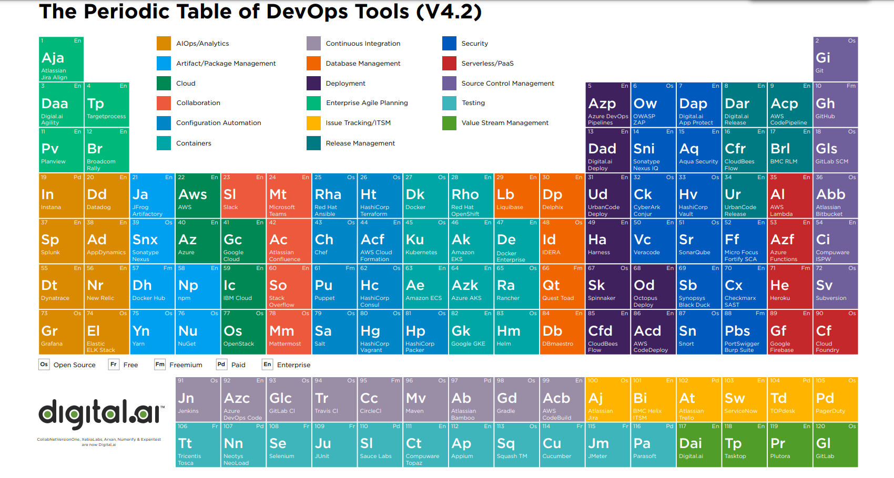

# DevOps Research Project - Michael and Harrison

## Topics for Research activity

- Research and create reports on following topics
  - What is [SRE](https://www.ibm.com/cloud/learn/site-reliability-engineering?utm_medium=OSocial&utm_source=Youtube&utm_content=000020LH&utm_term=10013860&utm_id=YTDescription-101-What-is-SRE-LH-SRE-Guide) - Site Reliatbility Engineer ?
  - Are SRE and [DevOps](https://www.ibm.com/cloud/learn/devops-a-complete-guide?utm_medium=OSocial&utm_source=Youtube&utm_content=000020LH&utm_term=10013860&utm_id=YTDescription-101-What-is-SRE-LH-DevOps-Guide#toc-how-we-got-IsFf3zMv) same or different, if different then how?
  - Various tools for setting DevOps?
- Make sure each group have a [git](https://github.com/) account, if none in the group have Github accounts please make one
- Reports should be in markdown form. If you want to know more about markdown use this [link](https://www.markdownguide.org/cheat-sheet/)

---

# Site Reliability Engineering (SRE)

## What is it?

- "SRE is what you get when you treat operations as if it’s a software problem" (Google). The idea of SRE is to automate software systems to make them more scalable and sustainable than typical manual intervention systems.
- SRE can aid in reducing problems between teams who want to continuously release updates and teams who only want to release when a feature is fool-proof.

### Site Reliability Engineers

- The engineers behind this practice focus on "keeping the lights on" in large-scale environments.
- They are software developers with IT operations experience who perform manual IT operations/administration tasks, while also developing code to automate those tasks.
- The goal of an SR Engineer is to do as much automation as possible to lessen the need for manual operations.
- An SR Engineer helps enable development teams to quickly produce software while also ensuring a level of acceptable operation (SLAs), helping bridge the gap between dev and operations teams.

## SRE Vs DevOps

Read about the differences [here](https://www.ibm.com/cloud/blog/three-differences-between-devops-and-sre)

### DevOps

- DevOps is an approach to culture, automation and platform design in order to increase customer value

### SRE

- SRE Uses software engineering to automate IT Operational Tasks that would normally be performed by systems administrators

In a sense, they are identical in philosophies, but differ in practicality, via:

|                                    | DevOps                                                                                                                                                                                                                            | SRE                                                                                                                                                                                                                                |
| ---------------------------------- | --------------------------------------------------------------------------------------------------------------------------------------------------------------------------------------------------------------------------------- | ---------------------------------------------------------------------------------------------------------------------------------------------------------------------------------------------------------------------------------- |
| **Skills**                         | DevOps are Coders. They lovewriting, testing, and pushing code to solve a problem.                                                                                                                                                | Investigative. They will analyze why something has gone wrong. They want to be proactive, not reactive.                                                                                                                            |
| **Automation**                     | DevOps Engineers want to automate deployment - Tasks and features                                                                                                                                                                 | Automate redundancy. They want to automate those tasks that have to be repeated over and over, turning them into programmatic tasks, keeping the system up and running.                                                            |
| **Development and Implementation** | focused on core _development_. They are working on the application as a whole, thereby solving a problem. They are Agile in approach, and deliver solutions that help the team build, test, deploy and monitor those applications | Core _Implementation_ They are giving feedback to the core development team saying things like _"This isn't working like you thought it would be"_ They leverage software to automate IT Operations tasks while minimizing IT Risk |

---

# Tools For DevOps

[PDF](http://aspetraining.com/files/DevOps-Tools-glossary.pdf)

There are a great number of tools that can sit in a DevOps toolbelt at any time. a condensed list would be things like:

- **Jenkins, Terraform** for Pipeline Development and Automation
- **Docker/Kubernetes** for Containerization
- **GitHub, GitLab, BitBucket** for Version Control
- **Splunk Phantom, Nagios** for Security monitoring
- **Vagrant** for Managing VMs
- **Ansible** for Configuration Management
- **Sumo Logic, Sentry, Log Rocket** for error/bug detection
- **Selenium** for testing automation
- **AWS, Azure, GCloud** for Scalable deployment services
