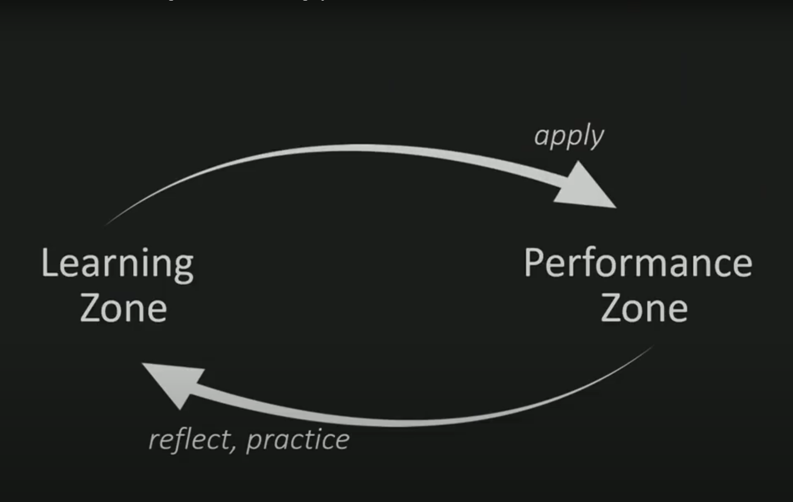

# Digital Mindset Series

## Part 1: Develop an Exploratory Mindset

---

# You are A Natural Explorer

As humans, one of our natural instincts is to explore and be curious.
But how can we _productively_ explore in such a way that will lead us to new avenues and ideas?

## There are 4 main areas of focus

1. **Keep an Open Mind**
   - Having a diverse mindset will create an endless amount of learning opportunities
2. **Proceed _Without_ Bias**
   - Research the topic with an unbiased perspective to ensure the most accurate outcome
3. **Remember What You Will Gain**
   - When beginning research, it may seem like a long road. Keep in mind the growth you will achieve from the result
4. **Explore Constantly**
   - Learning is a continuous process. There will always be some new topic to learn or enhance your existing knowledge.

## How Can You Be A Natural Explorer?

1. **Embrace Strategic Procrastination**
   - Give yourself time to come up with new ideas and multiple strategies
2. **Curate Cognitive Diversity**
   - Embrace your curiosity to learn lessons from other fields and keep an openness to new experiences
3. **Suspend Reality From Your Thoughts**
   - When you open the door to new learning, leave the all of the normal constraints, like time, or ability, at the door.

"_It's true that the early bird gets the worm, but we can't forget that the early worm gets caught_"
-Matthew Hirschey

## Embrace Your Curiosity!

`Lifelong Learner + Beginner Mindset = Curiosity Mindset`

- **Learning for Life**
  - Never stop learning new things
- **Think like a Beginner**
  - Ask yourself _What if I'm wrong?_ - then replace that fear of being wrong with Curiosity
- **Ask Questions!**
  - Without curiosity, new answers will cease to exist. Always continue to explore deeper into topics.

---

# Learning Resource Notes

[Eduardo Briceno - How to get better at the things you care about - TEDx](https://www.youtube.com/watch?v=YKACzIrog24)

- The most effective in any domain go through life alternating between two zones

|                | Learning Zone        | Performance Zone     |
| -------------- | -------------------- | -------------------- |
| Goal           | Improve              | Do as Best as we Can |
| Activities For | Improvement          | Execution            |
| Concentrate On | Haven't Mastered Yet | Have Mastered        |
| Mistakes To Be | Expected             | Minimized            |

Both of these zones should be a part of our lives, but being clear about when we want to be in a particular zone, with different goals, or expectations helps us to be better _and_ improve.

The Performance Zone maximizes our performance, while the Learning Zone maximizes both our **growth** and performance.

Our growth is hindered because we spend most of our time in the performance zone. And ultimately, over time, our performance becomes hindered.

The activities that we pursue in the Performance Zone ultimately enhance what we do in the Learning Zone.

For example, as a developer, if you spend all day studying a specific coding task, (like a section of a framework) you will become good at that task, however you won't really grow beyond the sum of your study - That is the learning zone. Now, if you were to, for example, practice typing on a daily basis, learn shortcuts in your IDE, etc, that enhances your learning. It digs into your Performance Zone to make you a better developer overall.

## Deliberate practice

Defined as breaking abilities down into component skills. You should be clear on what skill you are trying to improve (like learning IDE shortcuts). You are giving full attention to a challenge just outside your comfort zone - just above what you can currently do.

Gaining feedback is great for deliberate practice. If you can, enlist the help of a coach or mentor. Those people are well versed in the skill you are attempting to learn, and can provide great feedback.

Studies show that within the first couple of years in a profession, performance usually plateaus. This is because once we've reached that position of "adequacy," we stop spending time in the Learning Zone. we spend all of our time just "doing our job" or performing - Which isn't a good way to improve.
On the contrary, people who spend time in the learning zone always _do_ continue to improve.

## The way to High Performance is to Alternate Zones.

Being in the performance zone allows us to get things done, as best as we can. It can also help us to understand what we want or need to focus on next when we get back into the Learning Zone.

To get that performance level, we spend time in the learning zone to learn that new skill or concept, then apply what we learn in the performance zone. Then we can reflect and practice what we have learned as we cycle back to the learning zone.

One of the things we need to recognize is when we seek to learn, and when we seek to perform. And as much as we want to spend time in both, the more time we spend in the learning zone, the more we will improve.

## How do we Spend More Time in the Learning Zone?

First, we have to believe that we _can_ improve. That's the growth mindset. Second, we have to _want_ to improve at that skill. There has to be a purpose that we care about. Third, we need to have an idea of _how_ we can improve. This is where we practice deliberately. Fourth, we have to be in a _low stake situation_. If mistakes are to be made, then the result must not be catastrophic, or even very significant.

One of the reasons we spend most of our time in the performance zone is that our environment is usually high stake. Even in schools, students are afraid to enter that Learning Zone because they feel that if they make a mistake, others will think less of them. This is the primary cause for stress, and why there is no shift to the Learning Zone to learn new things.

In the workplace, there is often a flawless execution culture. Leaders foster this in order to encourage great work. But it leads employees to stay within what they know, and not try new things. Companies struggle to innovate and improve, and thus fall behind.

## So How do We Transition to the Learning Zone when the Stakes are Always High?

- Create low-stake islands in a high stakes sea - These are spaces where mistakes have little consequence. For example, finding a mentor or colleage and just bouncing ideas off one another, having conversations, or even role-play. Or setting time aside to read, or take online courses.
- Execute, and then reflect on the performance. Analyze what you did during the day and create learning opportunities from that analysis.
- Lead - Lower the stakes for others by sharing your experiences, gain feedback from others by sharing mistakes, and what we've learned from them, so that others can feel safe to do the same.

---

[Suzie Sheehy - The Case for Curiosity-Driven Research TEDx](https://www.youtube.com/watch?v=PlytMrKfOFA)
